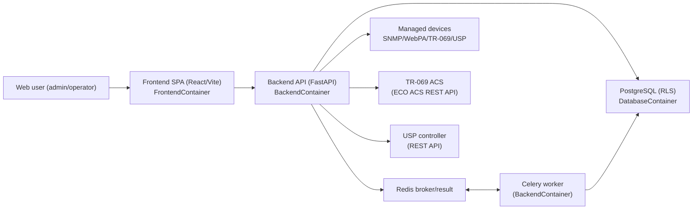

# Architecture Overview

## System Overview and Goals

The Device Remote Management platform is a multi‑protocol device management solution that provides a unified web‑based interface for managing network devices via SNMP (v2c/v3), WebPA, TR‑069/ACS, and TR‑369/USP. It is designed to support:

- **Multi‑tenant operation** where each tenant’s data and jobs are isolated by PostgreSQL Row Level Security (RLS).
- **Asynchronous device operations** using Celery and Redis so that slow network operations do not block the API or frontend.
- **Extensible protocol support** through dedicated protocol client modules for SNMP, WebPA, TR‑069 (via ECO ACS REST API), and USP.
- **Rich device knowledge bases** such as automatically parsed MIB modules and a TR‑181 parameter catalog.
- **Modern UI/UX** through a React + TypeScript single‑page application (SPA) that exposes device, job, MIB, and TR‑181 features.

The system is composed of several containers orchestrated via Docker Compose:

- **DatabaseContainer**: PostgreSQL 15 with RLS and migrations.
- **BackendContainer**: FastAPI backend with async PostgreSQL, JWT authentication, and Celery integration.
- **Worker**: Celery worker process based on the backend image.
- **FrontendContainer**: React + Vite SPA served via nginx.
- **Redis**: Broker and result backend for Celery.

## High‑Level System Architecture

At a high level, operators interact with the React frontend, which calls the FastAPI backend. The backend applies multi‑tenant context, persists and queries data in PostgreSQL, and offloads long‑running operations to Celery workers via Redis. Workers connect to managed devices or external controllers using protocol‑specific clients.

The FastAPI application is defined in `BackendContainer/src/main.py`, which configures CORS, installs `TenantContextMiddleware`, and registers routers under the following functional areas:

- `auth` (`src/api/routes/auth.py`)
- `tenants` (`src/api/routes/tenants.py`)
- `users` (`src/api/routes/users.py`)
- `devices` (`src/api/routes/devices.py`)
- `jobs` (`src/api/routes/jobs.py`)
- `mib` (`src/api/routes/mib.py`)
- `tr181` (`src/api/routes/tr181.py`)

## Backend Components

### Configuration and Settings

Application configuration is centralized in `BackendContainer/src/config.py` via the `Settings` class. It is loaded from `.env` and environment variables and includes:

- App metadata: `APP_NAME`, `APP_VERSION`
- Database: `DATABASE_URL` (async SQLAlchemy URL, e.g. `postgresql+asyncpg://...`)
- JWT: `JWT_SECRET`, `JWT_ALGORITHM`, `JWT_EXPIRES_IN`
- CORS: `CORS_ORIGINS` (comma‑separated list, parsed to `cors_origins_list`)
- Celery/Redis: `CELERY_BROKER_URL`, `CELERY_RESULT_BACKEND`
- Protocol defaults: SNMP, WebPA, TR‑069, and USP timeouts, retries, endpoints, and transport options
- SSE flag: `ENABLE_SSE` to enable or disable `/jobs/events/{job_id}`

These settings drive both the FastAPI app configuration and protocol client behavior.

### Database Access and Row Level Security

The backend uses SQLAlchemy’s async engine and sessions, configured in `src/db/session.py`:

- `get_engine()` returns the global `AsyncEngine`.
- `get_db_session(tenant_id, user_id)` is an `@asynccontextmanager` that:
  - Creates an `AsyncSession` from an async session maker.
  - Calls `_apply_rls_context` to execute:
    - `SELECT app.set_current_tenant(:tenant_id::uuid)`
    - `SELECT app.set_current_user(:user_id::uuid)`
  - Yields the session and commits or rolls back as needed.

The helper functions `app.set_current_tenant` and `app.set_current_user` and all RLS policies are defined in `DatabaseContainer/migrate.sh`. The policies enforce that every row in tenant‑scoped tables is only visible and writable when its `tenant_id` matches `current_setting('app.tenant_id')`. Some tables (e.g. `mib_modules`, `mib_oids`, `tr181_parameters`) allow `NULL tenant_id` to represent global/shared data.

Backend routes never directly construct SQL connection strings; they always rely on `get_db_session` so that RLS is consistently enforced.

### Authentication and Tenant Context

The authentication layer in `src/security/auth.py` provides:

- Password hashing and verification via `passlib`:
  - `hash_password(plain_password)`
  - `verify_password(plain_password, hashed_password)`
- JWT token creation:
  - `create_access_token(subject, tenant_id, additional_claims=None, expires_in=None)`
    - Embeds `sub` (user id), `tenant_id`, `iat`, `exp`, and `nbf`.
- JWT decoding:
  - `decode_token(token)` returns `(ok, claims, error)`.

The `TenantContextMiddleware` in `src/middleware/tenant_context.py`:

- Extracts a bearer token from the `Authorization` header.
- Decodes it using `decode_token`.
- Reads `tenant_id` and `sub` from claims.
- Attaches them as `request.state.tenant_id` and `request.state.user_id`.

All RLS‑aware route handlers (tenants, users, devices, jobs, MIB, TR‑181) use these state values when calling `get_db_session`.

The current implementation of `/auth/login` and `/auth/register` in `src/api/routes/auth.py` is a scaffold: it accepts input, creates demo user/tenant ids, and mints tokens without actually checking credentials against the database. The endpoints are documented in `API_REFERENCE.md` but should not be considered production‑ready authentication.

### Job Management and Celery Integration

The Celery configuration lives in `src/celery_app.py`:

- `_make_celery()` constructs a `Celery` app with broker and backend from settings, includes `"src.tasks.jobs"` and `"src.tasks.mib_tasks"`, and configures JSON serialization.
- `celery_app` is the singleton Celery application.
- `RLSTask` is a custom base task that:
  - Extracts `_tenant_id` and `_user_id` from task kwargs.
  - Exposes these as attributes on the task instance.
  - Provides helpers like `set_job_status` and `with_rls_session` for RLS‑aware DB writes.

Async job logic is implemented in `src/tasks/jobs.py`:

- Private helpers:
  - `_update_job_status(...)` updates the `jobs` row and upserts into `job_results` with JSON payloads.
  - `_check_cancellation(...)` queries `jobs.status` to see if a job was cancelled.
- Celery tasks, all bound to `RLSTask`:
  - `job.snmp_get`, `job.snmp_set`, `job.snmp_bulkwalk`
  - `job.webpa_get`, `job.webpa_set`
  - `job.tr069_get`, `job.tr069_set`
  - `job.usp_get`, `job.usp_set`

Each task:

1. Opens an RLS‑aware DB session using `get_db_session(tenant_id=self.tenant_id, user_id=self.user_id)`.
2. Sets job status to `"running"` and emits progress values.
3. Checks for cancellation.
4. Creates the appropriate protocol client (SNMP, WebPA, TR‑069, USP).
5. Performs the requested operation.
6. Updates the `jobs` and `job_results` tables on success or failure with structured error descriptors.

The HTTP surface for enqueueing jobs and streaming progress is implemented in `src/api/routes/jobs.py` and documented in `ASYNC_JOBS.md`.

### Protocol Clients

Protocol client implementations are in `src/protocols`:

- `snmp_client.py` provides an async SNMP client with `get`, `set`, and `bulk_walk`, supporting SNMPv2c and SNMPv3 with configurable timeouts, retries, and security parameters.
- `webpa_client.py` implements HTTP‑based WebPA GET/SET operations with multiple auth modes (basic, bearer, API key) and retry logic.
- `tr069_client.py` wraps the ECO ACS REST API for TR‑069 operations such as `GetParameterValues`, `SetParameterValues`, and `Download`.
- `usp_client.py` provides a USP controller client supporting GET/SET/OPERATE over HTTP, with placeholders for MQTT and WebSocket transports.

Celery tasks in `src/tasks/jobs.py` call these clients directly and encapsulate error handling for each protocol.

### MIB and TR‑181 Services

The MIB parsing service (`src/mib/parser.py`) is currently a simplified, file‑based implementation:

- `MIBParser.parse_file(file_path)` can handle single MIB files or `.tar.gz` archives.
- Real parsing with pysmi/pysnmp is stubbed; instead, `_extract_oids_from_content` returns deterministic example OIDs.
- Parsed data is intended to be stored in `mib_modules` and `mib_oids` via Celery tasks defined in `src/tasks/mib_tasks.py` (see `MIB` API for how tasks are enqueued).

TR‑181 parameter catalog functionality is provided by `src/tr181/catalog.py`:

- `TR181Catalog` maintains a dictionary of parameter metadata.
- `load_seed_data` loads built‑in example parameters (e.g. `Device.DeviceInfo.*`, `Device.WiFi.Radio.1.*`).
- `search_parameters`, `build_tree`, and `validate_parameters` provide search, tree building, and basic validation logic used by the TR‑181 API in `src/api/routes/tr181.py`.

## Frontend Components

The frontend is implemented in `FrontendContainer` using React, TypeScript, and Vite:

- Entry point: `src/main.tsx` renders `<App />` inside `BrowserRouter`, wraps it with `ThemeProvider` and adds `<ToastContainer />`.
- Application shell: `src/App.tsx` defines:
  - Top navigation bar with tenant switcher, theme toggle, and logout.
  - Responsive sidebar with navigation to:
    - `/dashboard`, `/devices`, `/devices/:id`, `/jobs`,
    - `/mib-browser`, `/tr181-browser`, `/audit`, `/settings`.
  - Route protection via `ProtectedRoute`, backed by the Zustand `auth` store.
- State management:
  - `src/store/auth.ts`: JWT token and user object persisted in localStorage; sets `auth_token` for SSE/WebSocket usage.
  - `src/store/tenant.ts`: tenant list and selected tenant id (also persisted).
  - `src/store/toast.ts`: global toast notifications.
- API integration:
  - `src/services/api.ts` exposes a singleton Axios instance that injects the JWT in `Authorization` and the tenant id in `X-Tenant-ID`. Note that the current backend only derives tenant context from JWT claims; the `X-Tenant-ID` header is not yet used server‑side.
- Real‑time features:
  - `src/utils/realtime.ts` provides `getSSEUrl` and `useSSE` for connecting to `/jobs/events/{job_id}` and an extensible `WebSocketClient` class (no WebSocket endpoint is currently implemented on the backend).
- Domain‑specific pages and components:
  - Devices: `Devices.tsx`, `DeviceDetail.tsx`, `DeviceTable.tsx`, `DeviceForm.tsx`.
  - Jobs: `Jobs.tsx`, `JobList.tsx`, `ResultViewer.tsx`, `QueryForm.tsx`.
  - MIB and TR‑181: `MIBBrowser.tsx`, `MIBTree.tsx`, `TR181Browser.tsx`, `TR181Tree.tsx`.
  - Settings, audit, and theming: `Settings.tsx`, `Audit.tsx`, `ThemeContext.tsx`, and the `ui/` components.

## Database Layer

The PostgreSQL schema and RLS policies are defined in `DatabaseContainer/migrate.sh` and summarised in `DatabaseContainer/README.md`. The main entity groups are:

- **Management and security**: `tenants`, `users`, `api_keys`, `rbac_roles`, `user_roles`, `audit_logs`.
- **Device registry and protocol configuration**: `devices`, `device_protocol_profiles`, `snmp_credentials`, `webpa_endpoints`, `tr069_endpoints`, `usp_endpoints`.
- **Jobs and results**: `jobs`, `job_results`.
- **Knowledge bases**: `mib_modules`, `mib_oids`, `tr181_parameters`.
- **Configuration management**: `config_templates`, `device_config_versions`.

All tenant‑scoped tables have RLS enabled, and there is an extensive set of indexes tailored to common access patterns (see `DATA_MODEL.md` for the ERD, relationships, RLS, and indexes).

## Observability and Logging

The current implementation focuses on basic health checks and container‑level logging:

- **Health checks**:
  - Backend: `/health` returns `{"status": "ok"}` and is used by Docker health checks.
  - Frontend: `GET /` is used as a simple liveness check by nginx/Docker.
  - Database: `pg_isready` in `docker-compose.yml`.
  - Redis: `redis-cli ping` in `docker-compose.yml`.
- **Backend logging**:
  - Python modules use the standard `logging` library (e.g. `src/mib/parser.py`, `src/api/routes/mib.py`, `src/api/routes/tr181.py`).
  - Docker is configured to stream logs to STDOUT/STDERR, which can be wired into centralized logging (ELK, Loki, CloudWatch, etc.) as described in `DEPLOYMENT.md`.
- **Metrics and tracing**:
  - There is no built‑in metrics or distributed tracing instrumentation in the codebase yet. `DEPLOYMENT.md` outlines options such as Prometheus + Grafana and cloud‑native monitoring, but these are not wired directly into the application code.

Future enhancements should standardize logging formats (e.g. JSON logs) and add explicit metrics for job throughput, failure rates, and protocol‑specific latencies.

## Known Limitations and Future Enhancements

The current codebase includes several scaffolds and mismatches that are important to call out for anyone building on top of it.

### Authentication and RBAC

- `/auth/login` and `/auth/register` in `src/api/routes/auth.py` mint demo tokens and do not yet validate credentials against the `users` table. Password hashing is available, but registration does not persist data.
- RBAC tables (`rbac_roles`, `user_roles`) and `api_keys` exist at the database level, but there are no API endpoints or middleware enforcing role‑based access in the backend routes.

### Tenant Context and Headers

- Tenant context is derived entirely from JWT claims via `TenantContextMiddleware`. The frontend sets an `X-Tenant-ID` header for each request, but no backend code reads or enforces this header today. Future work could validate that `X-Tenant-ID` matches the value in the JWT, or use it as an explicit override.

### Jobs API and Frontend Expectations

- The backend exposes explicit enqueue endpoints:
  - `/jobs/enqueue/snmp/get`, `/jobs/enqueue/webpa/get`, `/jobs/enqueue/tr069/get`, `/jobs/enqueue/usp/get`.
- The `Jobs` page in the frontend currently assumes generic endpoints like `/jobs/enqueue/{protocol}/{operation}` with a `{device_id, params}` payload, which do not exist on the backend.
- There is no HTTP endpoint for listing jobs (`GET /jobs`) or fetching a single job by id (`GET /jobs/{job_id}`), even though `JobList.tsx` currently attempts to call `GET /jobs`. The only implemented jobs‑related endpoint besides enqueueing is the SSE endpoint `/jobs/events/{job_id}`.

### Devices and Detail View

- The backend only defines `GET /devices` and `POST /devices` in `src/api/routes/devices.py`.
- The `DeviceDetail` page calls `GET /devices/{id}`, but there is no corresponding backend route. Implementing per‑device detail endpoints will require additional queries, including RLS‑aware joins to protocol configuration tables.

### MIB and TR‑181 Implementations

- MIB parsing is currently a stub that simulates OID extraction; full pysmi/pysnmp integration is not implemented.
- The `MIBTree` component passes a `search` query parameter to `/mib/modules/{id}/oids`, but the backend route uses `oid_prefix` and `name_search`. Aligning these contracts will require changes either in the frontend or the backend.
- TR‑181 seed data is synthetic and limited to a small set of example parameters. A full import from Broadband Forum specifications is not yet wired in.

### Real‑Time Channels

- Job progress is exposed via SSE at `/jobs/events/{job_id}` and is used by `JobList` via `useSSE`.
- The `WebSocketClient` in `src/utils/realtime.ts` is fully implemented on the client side, but there are no WebSocket endpoints on the backend. Any use of WebSockets will require new routes and authentication logic.

### Kubernetes Manifests

- `DEPLOYMENT.md` describes Kubernetes and cloud‑native deployment patterns, but there is no `k8s/` manifest directory in this repository. Those manifests are referenced as “to be created”.

All of these limitations should be considered when integrating this platform into a production environment. The current implementation is a solid architectural skeleton with working flows for demos (especially SNMP jobs and MIB/TR‑181 browsing), but it requires additional work to harden authentication, fill out APIs, and fully align frontend expectations with backend capabilities.
