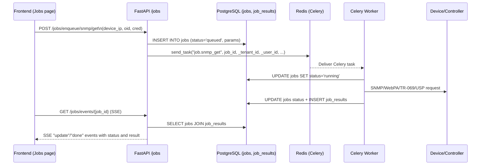

# Asynchronous Jobs and Event Flow

## Overview

Long‑running device operations such as SNMP queries, WebPA commands, TR‑069 interactions, and USP operations are executed asynchronously. This prevents the FastAPI backend from blocking on slow network calls and provides a consistent way to monitor progress.

The asynchronous pipeline is built on:

- FastAPI routes in `src/api/routes/jobs.py`
- Celery tasks in `src/tasks/jobs.py`
- Celery configuration in `src/celery_app.py`
- PostgreSQL tables `jobs` and `job_results`
- Redis as broker and result backend

This document explains how jobs are enqueued, executed, and observed through Server‑Sent Events (SSE).

## High‑Level Flow



## Data Model

The job system uses two tables defined in `DatabaseContainer/migrate.sh`:

- `jobs`
  - `id` (UUID, PK)
  - `tenant_id`, `device_id`, `kind`, `status`, `requested_by`
  - `params` (JSONB), `created_at`, `updated_at`
- `job_results`
  - `id` (UUID, PK)
  - `tenant_id`, `job_id` (unique), `result` (JSONB), `created_at`

Row Level Security (RLS) is enabled and policies restrict visibility to the current tenant:

```sql
CREATE POLICY rls_jobs ON jobs
  USING (tenant_id::text = current_setting('app.tenant_id', true))
  WITH CHECK (tenant_id::text = current_setting('app.tenant_id', true));

CREATE POLICY rls_job_results ON job_results
  USING (tenant_id::text = current_setting('app.tenant_id', true))
  WITH CHECK (tenant_id::text = current_setting('app.tenant_id', true));
```

All access to these tables in code goes through RLS‑aware sessions created by `get_db_session(tenant_id, user_id)`.

## Enqueueing Jobs

Routes in `src/api/routes/jobs.py` handle enqueueing:

- `POST /jobs/enqueue/snmp/get`
- `POST /jobs/enqueue/webpa/get`
- `POST /jobs/enqueue/tr069/get`
- `POST /jobs/enqueue/usp/get`

Each route:

1. Reads `tenant_id` and `user_id` from `request.state` (set by `TenantContextMiddleware`).
2. Rejects the request with `401` if context is missing.
3. Calls `_insert_job(tenant_id, user_id, kind, params)` to create a row in `jobs`.
4. Calls `_enqueue(task_name, job_id, tenant_id, user_id, kwargs)` to dispatch a Celery task.

Example for SNMP GET:

```python
job_id = await _insert_job(tenant_id, user_id, "SNMP_GET", body.model_dump())

_enqueue(
    "job.snmp_get",
    job_id,
    tenant_id,
    user_id,
    {"job_id": job_id, "device_ip": body.device_ip, "oid": body.oid, "cred": body.cred},
)
```

`_insert_job` uses an RLS‑aware session:

```python
async with get_db_session(tenant_id=tenant_id, user_id=user_id) as session:
    res = await session.execute(
        text(
            "INSERT INTO jobs (id, tenant_id, device_id, kind, status, requested_by, params) "
            "VALUES (gen_random_uuid(), current_setting('app.tenant_id')::uuid, NULL, :kind, 'queued', "
            "current_setting('app.user_id')::uuid, :params::jsonb) RETURNING id::text"
        ),
        {"kind": kind, "params": json.dumps(params)},
    )
```

## Celery Configuration and RLSTask

`src/celery_app.py` defines the Celery app and a custom task base:

- `celery_app` is initialized with broker and result backend from environment.
- `RLSTask` extends `celery.Task` and:

  - Pops `_tenant_id` and `_user_id` from task kwargs.
  - Stores them on the task instance (`self.tenant_id`, `self.user_id`).
  - Provides `set_job_status` and `with_rls_session` helpers for consistent DB access.

In the current code, most tasks open sessions explicitly via `get_db_session` instead of `with_rls_session`, but they still pass `tenant_id` and `user_id` via Celery kwargs and respect RLS.

## Job Execution Logic

Celery tasks are implemented in `src/tasks/jobs.py`. Each task is bound to `RLSTask`, e.g.:

```python
@celery_app.task(bind=True, base=RLSTask, name="job.snmp_get")
def snmp_get(self: RLSTask, job_id: str, device_ip: str, oid: str, cred: Dict[str, Any]) -> str:
    async def _run():
        async with get_db_session(tenant_id=self.tenant_id, user_id=self.user_id) as session:
            # ...
    asyncio.run(_run())
    return job_id
```

Key shared helpers:

- `_update_job_status(session, job_id, status, details=None, progress=None)`:
  - Updates the job’s `status` and `updated_at`.
  - If `details` is provided, upserts an entry into `job_results` with a JSON payload that may include result data, progress, and timestamps.
- `_check_cancellation(session, job_id)`:
  - Selects `status` from `jobs` and returns `True` if it equals `"cancelled"`.

### Example: SNMP GET Task

Simplified flow for `job.snmp_get`:

1. Mark job as running at 10% progress:

   ```python
   await _update_job_status(session, job_id, "running", progress=10)
   ```

2. Check for cancellation; if cancelled, mark job as `"cancelled"` with a message and return.
3. Build SNMP client parameters from `cred`:

   - `host`, `port`, `version`, `timeout`, `retries`
   - For v2c: `community`
   - For v3: `username`, `auth_protocol`, `auth_password`, `priv_protocol`, `priv_password`

4. Create client via `create_snmp_client(params)`.
5. Update progress to 50%.
6. Perform `await client.get(oid)`.
7. Close client and update job status to `"completed"` with a result payload:

   ```python
   await _update_job_status(
       session,
       job_id,
       "completed",
       {
           "protocol": "snmp",
           "operation": "get",
           "oid": oid,
           "result": result,
       },
       progress=100,
   )
   ```

8. Handle exceptions:
   - `SNMPTimeoutError` → `"failed"` with `"error": "timeout"`.
   - `SNMPAuthError` → `"failed"` with `"error": "authentication"`.
   - `SNMPClientError` → `"failed"` with `"error": "snmp_error"`.
   - `Exception` → `"failed"` with `"error": "unexpected"`.

Other tasks (`snmp_set`, `snmp_bulkwalk`, `webpa_get`, `webpa_set`, `tr069_get`, `tr069_set`, `usp_get`, `usp_set`) follow the same pattern: open RLS‑aware session, mark running, check cancellation, call protocol client, and persist a structured result or error.

## SSE Progress Streaming

### SSE Endpoint

`src/api/routes/jobs.py` implements `_sse_event_stream` and `job_events`:

- **GET `/jobs/events/{job_id}`**
  - Checks `ENABLE_SSE` from settings; returns `404` if disabled.
  - Uses `request.state.tenant_id` and `request.state.user_id` to open an RLS‑aware session.
  - Returns a `StreamingResponse` with `media_type="text/event-stream"`.

### Polling Loop

`_sse_event_stream(tenant_id, user_id, job_id)`:

1. If `tenant_id` or `user_id` is missing, yields an `error` event and returns.
2. Enters a loop (up to ~60 seconds at 0.5s intervals):
   - Runs a `SELECT` joining `jobs` and `job_results`:

     ```sql
     SELECT j.status, coalesce(to_jsonb(r.result), '{}'::jsonb)
     FROM jobs j
     LEFT JOIN job_results r ON j.id = r.job_id
     WHERE j.id = :job_id::uuid
     ```

   - Builds a `payload = {"status": status_val, "result": result_val}`.
   - If the status has changed since the last iteration, emits:

     ```text
     event: update
     data: {"status": "...", "result": {...}}
     ```

   - If `status` is `"completed"` or `"failed"`, emits a final `done` event and exits.

3. Sleeps 0.5 seconds between iterations.

The result JSON stored by Celery tasks is nested, so SSE consumers typically need to inspect `event.data.result.result` for protocol‑specific fields.

### Frontend Consumption

`src/utils/realtime.ts` provides:

- `getSSEUrl(path: string)` — builds a full SSE URL from `VITE_API_BASE_URL` and the relative path.
- `useSSE(url, enabled)` — a React hook that:
  - Optionally appends a `token` query parameter (from `auth_token` in localStorage).
  - Opens an `EventSource` connection and parses incoming JSON into `data`.

`JobList.tsx` uses:

- `const sseUrl = selectedJobId ? getSSEUrl(`/jobs/events/${selectedJobId}`) : null;`
- `const { data: jobUpdate } = useSSE(sseUrl, !!selectedJobId);`

It then updates in‑memory job status when SSE messages arrive and can show a live JSON view of `jobUpdate`.

## Cancellation

The job model supports cancellation at the database level:

- Users or administrative processes can update `jobs.status` to `"cancelled"`.
- Each task periodically calls `_check_cancellation(session, job_id)`:
  - If it returns `True`, the task updates job status to `"cancelled"` with a message and returns early.

While there is no HTTP endpoint implemented for cancelling jobs yet, the pattern in `_check_cancellation` and `_update_job_status` is prepared for such an endpoint.

## Error Handling and Resilience

Key resilience aspects:

- Jobs are always created in the database before Celery tasks are dispatched (no “orphan” jobs without rows).
- Celery tasks wrap protocol calls in detailed `try/except` blocks with protocol‑specific error classes (e.g. `WebPAClientError`, `TR069TimeoutError`, `USPAuthError`).
- Every failure path calls `_update_job_status` to mark the job `"failed"` and store a structured error payload.
- Job results are stored with the current tenant context, ensuring RLS constraints are respected.

From an operational perspective (see `OPERATIONS_RUNBOOK.md`), operators can:

- Inspect `jobs` and `job_results` directly via SQL for advanced debugging.
- Scale the `worker` service horizontally when job throughput needs to increase.
- Monitor Redis and worker logs for protocol errors or high queue depth.

## Summary

The asynchronous job system provides a robust pattern for offloading long‑running operations:

- FastAPI routes create `jobs` rows and enqueue Celery tasks with tenant/user context.
- Celery workers execute protocol operations under RLS, update `jobs` and `job_results`, and encode structured outcomes.
- SSE streaming allows clients to track job status changes in near real time.

This design keeps the web API responsive, centralizes multi‑tenant isolation in the database, and provides a clear extension point for adding new protocol operations or job types.
