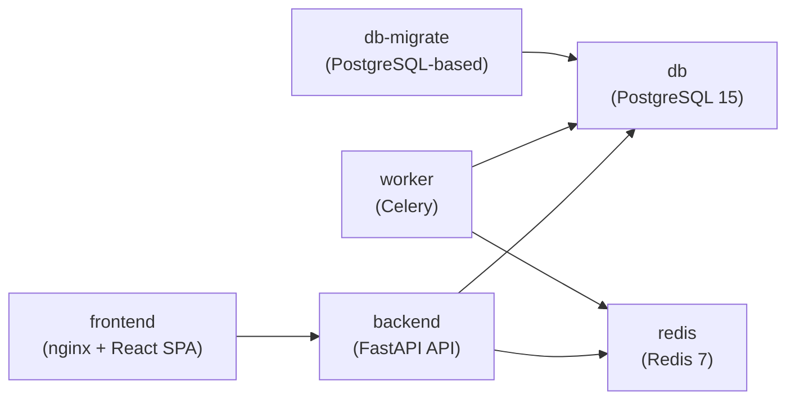

# Container Architecture

## Overview

The Device Remote Management platform is deployed as a multi‑container application orchestrated via Docker Compose. Each container has a clear responsibility and well‑defined dependencies, making it easy to run the full stack locally and to map the same topology into production environments.

The primary services are:

- `db`: PostgreSQL database with RLS‑enabled schema and migrations.
- `redis`: Redis instance serving as Celery broker and result backend.
- `db-migrate`: one‑shot migration runner that initializes schema, RLS, indexes, and seed data.
- `backend`: FastAPI backend exposing REST APIs and OpenAPI docs.
- `worker`: Celery worker that executes long‑running protocol operations.
- `frontend`: React + Vite SPA served via nginx.

All services share a common Docker network `drm-network` defined in `docker-compose.yml`.

## Container Interaction Diagram

The `db-migrate` container runs only during initialization. All other services are long‑running and restarted on failure as configured in `docker-compose.yml`.

## Database: `db` (PostgreSQL)

**Image:** `postgres:15-alpine`  
**Container name:** `drm-database`  
**Ports:**

- Internal: `5432`
- External: `${POSTGRES_EXTERNAL_PORT:-5000}` → `5432`

**Environment variables:**

- `POSTGRES_DB` (default `myapp`)
- `POSTGRES_USER` (default `appuser`)
- `POSTGRES_PASSWORD` (default `dbuser123`)
- `POSTGRES_PORT` (internal port, default `5432`)

**Volumes:**

- `postgres_data:/var/lib/postgresql/data` — persistent database data.
- `DatabaseContainer/migrate.sh` mounted into `/docker-entrypoint-initdb.d/migrate.sh` — this integrates with the container’s entrypoint but core migrations are driven by `db-migrate` (see below).

**Health check:**

- `pg_isready -U appuser -d myapp` every 10 seconds, 5 seconds timeout, 5 retries.

The database schema, RLS policies, indexes, and seed data are defined in `DatabaseContainer/migrate.sh` and described in `DatabaseContainer/README.md`. All application access goes through the backend (no direct DB access from the frontend or from users).

## Redis: `redis` (Broker and Result Backend)

**Image:** `redis:7-alpine`  
**Container name:** `drm-redis`  
**Ports:**

- Internal and external: `${REDIS_EXTERNAL_PORT:-6379}` → `6379`

**Volumes:**

- `redis_data:/data` — append‑only file (AOF) persistence.

**Command:**

- `redis-server --appendonly yes` (enables durable append‑only file mode).

**Health check:**

- `redis-cli ping` every 10 seconds, 3 seconds timeout, 5 retries.

Redis is used by Celery as both broker and result backend. The backend and worker reference it via:

- `CELERY_BROKER_URL=redis://redis:6379/0`
- `CELERY_RESULT_BACKEND=redis://redis:6379/1`

## Database Migration Runner: `db-migrate`

**Image:** `postgres:15-alpine`  
**Container name:** `drm-db-migrate`  
**Type:** One‑time initialization service

**Dependencies:**

- Depends on `db` with `condition: service_healthy`.

**Volumes:**

- `./DatabaseContainer:/workspace`

**Working directory:**

- `/workspace`

**Command:**

The command run by `db-migrate`:

- Writes a `db_connection.txt` file pointing to the `db` service.
- Marks `migrate.sh` as executable.
- Runs `./migrate.sh up`, which:
  - Creates extensions, schemas, helper functions.
  - Creates all core tables.
  - Applies RLS policies and indexes.
  - Seeds initial tenant, admin user, device, and sample data.

Once migrations succeed, the container exits, and its status is used as a dependency condition for `backend` and `worker`.

## Backend API: `backend` (FastAPI)

**Build context:** `./BackendContainer`  
**Dockerfile:** `BackendContainer/Dockerfile`  
**Container name:** `drm-backend`  
**Ports:**

- Internal: `8080`
- External: `${BACKEND_PORT:-8080}` → `8080`

**Dependencies:**

- `db` (healthy)
- `redis` (healthy)
- `db-migrate` (completed successfully)

**Environment variables (from `docker-compose.yml`):**

- `DATABASE_URL=postgresql+asyncpg://appuser:...@db:5432/myapp`
- `CELERY_BROKER_URL=redis://redis:6379/0`
- `CELERY_RESULT_BACKEND=redis://redis:6379/1`
- `JWT_SECRET` (must be overridden in production)
- `JWT_EXPIRES_IN` (defaults to `3600`)
- `CORS_ORIGINS` (defaults to local frontend origins)
- `ENABLE_SSE` (controls `/jobs/events/{job_id}`)
- `PORT=8080` (used by the ASGI server)

**Volumes:**

- `./BackendContainer/src:/app/src` — allows hot‑reload or live code changes in a dev/test setup.
- `backend_uploads:/app/uploads` — storage for user uploads (e.g. MIB files).

**Health check:**

- `curl -f http://localhost:8080/docs` every 30 seconds, 10 seconds timeout.

**Responsibilities:**

- Hosts FastAPI application defined in `src/main.py`.
- Implements core REST APIs in `src/api/routes/` (auth, tenants, users, devices, jobs, MIB, TR‑181).
- Implements multi‑tenant context via `TenantContextMiddleware`.
- Manages RLS‑aware database sessions via `src/db/session.py`.
- Exposes OpenAPI documentation (`/docs`, `/redoc`, `/openapi.json`).

## Celery Worker: `worker`

**Build context:** `./BackendContainer`  
**Dockerfile:** `BackendContainer/Dockerfile`  
**Container name:** `drm-worker`  
**Command:**

- `celery -A src.celery_app.celery_app worker -l info -Q celery`

**Dependencies:**

- `db` (healthy)
- `redis` (healthy)
- `db-migrate` (completed successfully)

**Environment variables:**

- Same `DATABASE_URL`, `CELERY_BROKER_URL`, `CELERY_RESULT_BACKEND`, and `JWT_SECRET` as the backend.

**Volumes:**

- `./BackendContainer/src:/app/src`
- `backend_uploads:/app/uploads`

**Responsibilities:**

- Executes Celery tasks registered under `"src.tasks.jobs"` and `"src.tasks.mib_tasks"`.
- Runs protocol operations (SNMP/WebPA/TR‑069/USP) and MIB parsing under tenant/user context via `RLSTask` and `get_db_session`.
- Updates `jobs` and `job_results` tables with status, progress, and results.

**Scaling:**

- Docker Compose supports scaling workers horizontally:
  - `docker-compose up -d --scale worker=3`

## Frontend: `frontend` (React + nginx)

**Build context:** `./FrontendContainer`  
**Dockerfile:** `FrontendContainer/Dockerfile`  
**Container name:** `drm-frontend`  
**Ports:**

- Internal: `80` (nginx)
- External: `${FRONTEND_PORT:-3000}` → `80`

**Build arguments:**

- `VITE_API_BASE_URL` (build‑time configuration baked into the SPA), defaulting to `http://localhost:8080`.

**Dependencies:**

- Depends on `backend` being healthy.

**Health check:**

- `wget --quiet --tries=1 --spider http://localhost:80` every 30 seconds.

**Responsibilities:**

- Serves the compiled React SPA from `/usr/share/nginx/html`.
- Provides the web UI for:
  - Authentication and tenant context selection.
  - Device registry management.
  - Job enqueue and monitoring.
  - MIB upload and browsing.
  - TR‑181 parameter browsing.
  - Settings, audit, and UX features (dark/light theme, toasts, etc.).

## Volumes and Network

### Volumes

- `postgres_data` — Persistent PostgreSQL data directory.
- `redis_data` — Redis append‑only file data.
- `backend_uploads` — Upload storage for backend (e.g., MIB files).

In development, you can reset state by removing volumes (`docker-compose down -v`), but in production you should treat the database volume as critical state and follow backup procedures described in `DOCKER.md` and `DEPLOYMENT.md`.

### Network

- `drm-network` — Bridge network that connects all services.

Service hostnames on this network:

- `db` — PostgreSQL
- `redis` — Redis
- `backend` — FastAPI backend
- `worker` — Celery worker
- `frontend` — nginx/SPA (for internal debugging; users generally access via the published host port)

## Startup Order and Health

`docker-compose.yml` enforces a robust startup order:

1. `db` and `redis` start and become healthy.
2. `db-migrate` connects to `db`, writes `db_connection.txt`, and runs `migrate.sh up`.
3. `backend` starts after `db`, `redis`, and `db-migrate` report success.
4. `worker` starts after the same conditions, ensuring schema and RLS are available.
5. `frontend` starts after `backend` is healthy.

Each service has a health check so that Docker Compose can detect failures and restart containers where appropriate. This topology is the basis for the deployment guidance documented in `DEPLOYMENT_GUIDE.md` and the more detailed production considerations in `DEPLOYMENT.md`.
