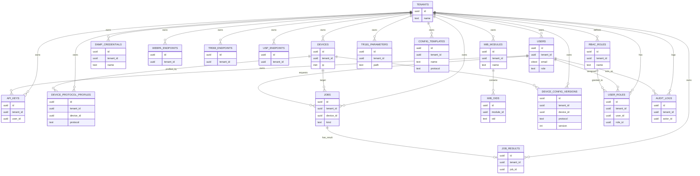

# Data Model and Persistence

## Overview

The Device Remote Management platform uses PostgreSQL 15 as its primary data store. The schema is optimized for multi‑tenant isolation, protocol‑specific configuration, background jobs, and device knowledge bases (MIBs and TR‑181 parameters).

This document summarises:

- Core entities and how they relate to each other.
- The entity‑relationship diagram (ERD).
- Row Level Security (RLS) policies and how the backend applies tenant context.
- Key indexes that support common query patterns.

All schema, RLS, and index definitions are implemented in `DatabaseContainer/migrate.sh` and described at a high level in `DatabaseContainer/README.md`.

## Core Entity Groups

### Tenancy and Identity

**Tables:**

- `tenants`
  - `id` (UUID, PK, default `gen_random_uuid()`)
  - `name` (unique tenant name)
  - `created_at` (timestamp)
- `users`
  - `id` (UUID, PK)
  - `tenant_id` (FK → tenants.id, cascade on delete)
  - `email` (`citext`, unique)
  - `hashed_password` (text)
  - `role` (simple text role string, e.g. `admin`, `user`)
  - `created_at` (timestamp)
- `api_keys`
  - `id` (UUID, PK)
  - `tenant_id` (FK → tenants.id)
  - `user_id` (FK → users.id)
  - `key_hash` (hashed API key)
  - `label`, `created_at`, `last_used_at`
- `rbac_roles`
  - `id` (UUID, PK)
  - `tenant_id` (FK → tenants.id)
  - `name` (role name, unique per tenant)
  - `description`
  - `permissions` (JSONB array of permissions)
  - `created_at`
- `user_roles`
  - `id` (UUID, PK)
  - `tenant_id` (FK → tenants.id)
  - `user_id` (FK → users.id)
  - `role_id` (FK → rbac_roles.id)
  - `created_at`

These tables underpin both coarse‑grained roles (via the `role` field on `users`) and finer‑grained, JSON‑based RBAC policies through `rbac_roles` and `user_roles`. Although the backend code does not yet enforce RBAC at the route level, the schema supports future expansion.

### Device Registry and Protocol Configuration

**Tables:**

- `devices`
  - `id` (UUID, PK)
  - `tenant_id` (FK → tenants.id)
  - `name` (device name)
  - `ip` (INET)
  - `metadata` (JSONB, arbitrary device attributes)
  - `created_by` (FK → users.id, nullable)
  - `created_at`
- `device_protocol_profiles`
  - `id` (UUID, PK)
  - `tenant_id` (FK → tenants.id)
  - `device_id` (FK → devices.id)
  - `protocol` (`'SNMP' | 'WEBPA' | 'TR69' | 'USP'`)
  - `profile` (JSONB describing protocol‑specific configuration)
  - `created_at`
- `snmp_credentials`
  - `id` (UUID, PK)
  - `tenant_id` (FK → tenants.id)
  - `name` (unique per tenant)
  - `version` (`'v2c' | 'v3'`)
  - `params` (JSONB with fields like `community`, `username`, `auth_protocol`, `auth_password`, etc.)
  - `created_at`
- `webpa_endpoints`
- `tr069_endpoints`
- `usp_endpoints`

Each of the endpoint tables (`webpa_endpoints`, `tr069_endpoints`, `usp_endpoints`) follow a similar pattern:

- `id` (UUID, PK)
- `tenant_id` (FK → tenants.id)
- `name` (label, unique per tenant)
- `base_url` (endpoint base URL)
- `auth` (JSONB auth configuration, e.g. `{ "type": "bearer", ... }`)
- `created_at`

These tables are used by Celery tasks in `src/tasks/jobs.py` when constructing protocol clients.

### Jobs and Results

**Tables:**

- `jobs`
  - `id` (UUID, PK)
  - `tenant_id` (FK → tenants.id)
  - `device_id` (FK → devices.id, nullable, because some jobs are defined by IP/endpoint only)
  - `kind` (text, e.g. `SNMP_GET`, `WEBPA_GET`, `TR069_GET`, `USP_GET`)
  - `status` (text: `queued`, `running`, `completed`, `failed`, `cancelled`, etc.)
  - `requested_by` (FK → users.id)
  - `params` (JSONB, protocol‑specific parameters)
  - `created_at`
  - `updated_at`
- `job_results`
  - `id` (UUID, PK)
  - `tenant_id` (FK → tenants.id)
  - `job_id` (FK → jobs.id, unique)
  - `result` (JSONB — arbitrary result structure)
  - `created_at`

The jobs API (`src/api/routes/jobs.py`) inserts a row into `jobs` before dispatching a Celery task. Celery tasks in `src/tasks/jobs.py` update `status` and write `job_results` entries via helper functions that include progress and structured error information.

### MIB Knowledge Base

**Tables:**

- `mib_modules`
  - `id` (UUID, PK)
  - `tenant_id` (FK → tenants.id, nullable for global modules)
  - `name` (module name, unique per `(tenant_id, name)`)
  - `created_at`
- `mib_oids`
  - `id` (UUID, PK)
  - `tenant_id` (FK → tenants.id, nullable for global OIDs)
  - `module_id` (FK → mib_modules.id)
  - `oid` (text OID, e.g. `1.3.6.1.2.1.1.1.0`)
  - `name` (symbolic OID name)
  - `syntax`, `access`, `description`
  - `created_at`

The MIB API in `src/api/routes/mib.py` queries these tables:

- `GET /mib/modules` returns `MIBModuleList`.
- `GET /mib/modules/{id}` returns `MIBModule`.
- `GET /mib/modules/{id}/oids` returns paginated `MIBOIDList`.
- `DELETE /mib/modules/{id}` deletes tenant‑owned modules and cascades OIDs.

### TR‑181 Parameter Catalog

**Table:**

- `tr181_parameters`
  - `id` (UUID, PK)
  - `tenant_id` (FK → tenants.id, nullable for global parameters)
  - `path` (text, e.g. `Device.DeviceInfo.Manufacturer`)
  - `schema` (JSONB describing type, access, description, etc.)
  - `created_at`

The TR‑181 API in `src/api/routes/tr181.py` uses this table for import, search, tree building, and validation. It treats `tenant_id IS NULL` as global/shared parameters and allows tenant‑specific overrides.

### Configuration Management

**Tables:**

- `config_templates`
  - `id` (UUID, PK)
  - `tenant_id` (FK → tenants.id)
  - `name` (template name)
  - `protocol` (`'SNMP' | 'WEBPA' | 'TR69' | 'USP'`)
  - `content` (JSONB with template data)
  - `created_at`
- `device_config_versions`
  - `id` (UUID, PK)
  - `tenant_id` (FK → tenants.id)
  - `device_id` (FK → devices.id)
  - `protocol`
  - `version` (integer)
  - `content` (JSONB)
  - `created_at`

These tables support storing configuration templates and versioned per‑device configurations.

### Audit and Governance

**Table:**

- `audit_logs`
  - `id` (UUID, PK)
  - `tenant_id` (FK → tenants.id)
  - `actor_id` (FK → users.id)
  - `action` (text)
  - `details` (JSONB, structured payload)
  - `created_at`

Seed data includes at least one audit log entry describing the initial migration run (`action='seed_init'`).

## Entity‑Relationship Diagram

The following Mermaid ERD captures the core relationships between the main tables. It is intentionally simplified and does not list every column.



This diagram focuses on cardinalities and high‑level relationships; for complete column definitions, refer to `DatabaseContainer/migrate.sh`.

## Row Level Security (RLS)

### Helper Functions and GUCs

`migrate.sh` defines helper functions in the `app` schema:

- `app.set_current_tenant(tenant_uuid UUID)`
- `app.set_current_user(user_uuid UUID)`

These functions set PostgreSQL configuration parameters:

- `current_setting('app.tenant_id')`
- `current_setting('app.user_id')`

The backend’s `get_db_session(tenant_id, user_id)` executes these functions at the beginning of each session, ensuring that all subsequent queries run under the correct tenant/user context.

### Enabled Tables

RLS is enabled on all tenant‑scoped tables:

- `users`, `api_keys`
- `devices`, `device_protocol_profiles`
- `snmp_credentials`, `webpa_endpoints`, `tr069_endpoints`, `usp_endpoints`
- `jobs`, `job_results`
- `mib_modules`, `mib_oids`
- `tr181_parameters`
- `config_templates`, `device_config_versions`
- `audit_logs`
- `rbac_roles`, `user_roles`

### Policy Patterns

For strictly tenant‑scoped tables, policies have the pattern:

```sql
CREATE POLICY rls_devices ON devices
  USING (tenant_id::text = current_setting('app.tenant_id', true))
  WITH CHECK (tenant_id::text = current_setting('app.tenant_id', true));
```

This ensures that:

- A row can only be read if its `tenant_id` matches the current context.
- A row can only be inserted or updated if its `tenant_id` matches the current context.

For tables that allow global/shared data (e.g. `mib_modules`, `mib_oids`, `tr181_parameters`), policies look like:

```sql
CREATE POLICY rls_tr181_parameters ON tr181_parameters
  USING (
    tenant_id::text IS NULL
    OR tenant_id::text = current_setting('app.tenant_id', true)
  )
  WITH CHECK (
    tenant_id::text IS NULL
    OR tenant_id::text = current_setting('app.tenant_id', true)
  );
```

This allows:

- Global rows (`tenant_id IS NULL`) to be visible to all tenants.
- Tenant‑specific rows to be visible only to the associated tenant.

### Backend Usage

The backend always calls `get_db_session(tenant_id, user_id)` in RLS‑aware routes. For example:

- `src/api/routes/jobs.py` uses `get_db_session` within `_insert_job` and `_sse_event_stream`.
- `src/api/routes/mib.py` and `src/api/routes/tr181.py` use `get_db_session` to enforce visibility restrictions for modules, OIDs, and parameters.

Celery tasks also use tenant/user context by:

1. Receiving `_tenant_id` and `_user_id` kwargs from enqueueing code.
2. Opening sessions with `get_db_session(tenant_id=self.tenant_id, user_id=self.user_id)` inside each task.

This approach ensures that job status updates and job results always respect tenant boundaries.

## Indexes and Performance

`migrate.sh` creates a number of indexes to support common query patterns:

- **Tenants and users:**
  - `idx_tenants_name` — quick lookup by tenant name.
  - `idx_users_tenant` — filter users by tenant.
  - `idx_users_email` — lookup user by email.
- **API keys:**
  - `idx_api_keys_tenant_user` — filter keys by tenant and user.
  - `idx_api_keys_last_used` — sort by last used timestamp.
- **Devices and protocol profiles:**
  - `idx_devices_tenant` — list devices by tenant.
  - `idx_devices_ip` — lookup devices by IP.
  - `idx_devices_name` — search devices by name.
  - `idx_device_protocol_profiles_device_protocol` — find profiles by device and protocol.
- **Protocol endpoints:**
  - `idx_snmp_credentials_tenant`
  - `idx_webpa_endpoints_tenant`
  - `idx_tr069_endpoints_tenant`
  - `idx_usp_endpoints_tenant`
- **Jobs and results:**
  - `idx_jobs_tenant_status` — list jobs per tenant by status.
  - `idx_jobs_device` — find jobs per device.
  - `idx_jobs_updated` — recent jobs by `updated_at` (descending).
  - `idx_job_results_job` — join job_results to jobs.
- **MIB and TR‑181:**
  - `idx_mib_modules_tenant_name` — locate MIB modules by tenant/name.
  - `idx_mib_oids_module_oid` and `idx_mib_oids_oid` — query OIDs by module and OID text.
  - `idx_tr181_parameters_path` — search by TR‑181 path prefix.
- **Configuration and audit:**
  - `idx_config_templates_tenant`
  - `idx_device_config_versions_device_proto_version`
  - `idx_audit_logs_tenant_created` — audit logs sorted by creation time.
  - `idx_rbac_roles_tenant`
  - `idx_user_roles_tenant_user`

These indexes are particularly important for:

- Paged MIB module and OID queries in `src/api/routes/mib.py`.
- TR‑181 parameter search and tree building in `src/api/routes/tr181.py`.
- Job queries performed by `_sse_event_stream` in `src/api/routes/jobs.py`, which poll by job id and join `jobs` with `job_results`.

## Seed Data

`apply_seeds` in `migrate.sh` populates a minimal but useful initial dataset:

- Default tenant (`'Default'`).
- Admin RBAC role (`'admin'`) and membership.
- Admin user `admin@example.com` with a placeholder password hash (`'demo-hash'`).
- Sample device `Router-01` with IP `192.168.1.1`.
- SNMP credential `public-v2c` and a device protocol profile pointing to it.
- Example MIB module `RFC1213-MIB` with OID `1.3.6.1.2.1.1.1.0`.
- Example TR‑181 parameter `Device.DeviceInfo.`.
- Example configuration template and example job/job_result.
- A seed audit log entry.

These seeds are intended primarily for development and demos. They assume the backend will later implement proper password hashing, tenant provisioning, and job creation flows.

## Summary

The data model provides a solid foundation for multi‑tenant device management with asynchronous jobs and rich protocol metadata. RLS and carefully chosen indexes are integral to achieving tenant isolation and performance. Backend code is tightly coupled to this schema via explicit SQL in `src/api/routes/*.py` and `src/tasks/*.py`, so any schema changes should be reflected in the corresponding code and documentation.

For more details on how this schema is used at runtime, see `ASYNC_JOBS.md` (jobs and job_results flow), `API_REFERENCE.md` (tables behind each endpoint), and `SECURITY.md` (RLS and tenant isolation).
