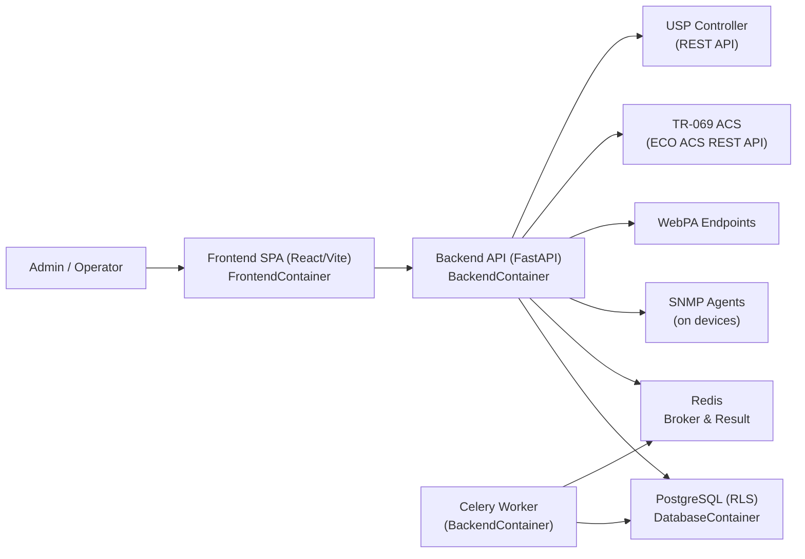

# System Context

## Overview

This document describes the Device Remote Management platform in terms of its environment: who uses it, which external systems it interacts with, and how the internal containers collaborate to provide device management features.

From a system‑of‑systems perspective, the platform sits between human operators and various device‑side or controller‑side protocols, providing a unified interface for querying, configuring, and monitoring network devices.

## Primary Actors

### Human Users

The main human actors are:

- **Platform administrators** who provision tenants, create users, manage roles, and operate the system.
- **Tenant operators** who manage their own devices, configure credentials and endpoints, and run jobs (SNMP/WebPA/TR‑069/USP queries and configuration updates).
- **Support and NOC engineers** who monitor devices, inspect job results, and investigate audit logs.

These users interact with the system exclusively through the web frontend hosted by `FrontendContainer`, which is a React + TypeScript SPA accessed over HTTPS.

### Managed Devices and Controllers

On the device side, the platform interacts with:

- **SNMP agents** running on managed network devices (routers, CPEs, switches) that expose the MIB tree.
- **WebPA agents** accessible over HTTP for parameter reads and writes.
- **TR‑069 ACS (ECO ACS REST API)** that manages TR‑069 devices; the backend talks to the ACS, which in turn communicates with CPEs.
- **USP (TR‑369) controllers** providing HTTP‑based APIs to manipulate USP data models.

These external systems are not part of this repository; instead, the backend integrates with them via protocol‑specific clients defined under `BackendContainer/src/protocols/`.

### Infrastructure Services

The platform depends on the following infrastructure components:

- **PostgreSQL database** (`DatabaseContainer`) which stores tenants, users, devices, protocol configuration, jobs, job results, MIB modules/OIDs, TR‑181 parameters, configuration templates, and audit logs.
- **Redis** (standard image in `docker-compose.yml`) acting as the Celery broker and result backend.
- **Celery workers** (Worker service built from `BackendContainer`) that execute long‑running network operations.
- **Reverse proxy and TLS terminators** in production (not defined in this repository, but described in `DEPLOYMENT.md`).

## Context Diagram

The following diagram shows the platform’s context and high‑level relationships:

Key points:

- Users never access the backend, database, or Redis directly; all access is mediated by the SPA and the FastAPI backend.
- Job enqueue operations are handled by FastAPI, persisted in PostgreSQL, and dispatched to Celery via Redis.
- Celery workers connect outward to device‑side endpoints using SNMP/WebPA/TR‑069/USP, using credentials and endpoints stored in the database.

## User Flows

### Authentication and Tenant Context

1. A user navigates to the frontend (`/` on the frontend container).
2. If the user is not authenticated, `App.tsx` redirects to `/login`, rendering `Login.tsx`.
3. The login form posts credentials to `POST /auth/login` on the backend.
4. The backend (currently a scaffold) issues a JWT containing `sub` (user id) and `tenant_id`.
5. The frontend stores the token and user in the Zustand `auth` store and localStorage (`auth_token`) and redirects to the main routes.
6. For subsequent requests:
   - `src/services/api.ts` injects `Authorization: Bearer <token>` and `X-Tenant-ID` headers.
   - `TenantContextMiddleware` decodes the JWT and sets `request.state.tenant_id` and `request.state.user_id`.
   - Route handlers use `get_db_session(tenant_id, user_id)` so that PostgreSQL RLS policies isolate tenant data.

### Device Management

1. The user navigates to `/devices`, which renders `Devices.tsx`.
2. `DeviceTable.tsx` calls `GET /devices` to list devices scoped to the current tenant (currently a scaffold returning an empty list).
3. `DeviceForm.tsx` uses `POST /devices` to register a new device with fields defined in `src/models/schemas.py` (`DeviceCreate`).
4. Once device detail endpoints are implemented, the `DeviceDetail.tsx` page is expected to use `GET /devices/{id}` to show metadata and enable protocol‑level queries.

### MIB and TR‑181 Browsing

- **MIB Browser (`/mib-browser`)**:
  1. The `MIBBrowser` page allows uploading a `.mib`, `.txt`, or `.tar.gz` file to `POST /mib/upload`.
  2. The backend saves the file to a temporary path and enqueues `parse_mib_file` via Celery.
  3. `MIBTree.tsx` calls `GET /mib/modules` to list modules and `GET /mib/modules/{module_id}/oids` to browse OIDs (see `src/api/routes/mib.py`).

- **TR‑181 Browser (`/tr181-browser`)**:
  1. `TR181Tree.tsx` calls `GET /tr181/tree` to retrieve a hierarchical tree of TR‑181 parameters rooted at a specified path.
  2. It calls `GET /tr181/parameters` with `path_prefix` and `search` filters to list parameters.
  3. Optional import and validation flows are available through `POST /tr181/import` and `POST /tr181/validate`.

### Asynchronous Jobs and Monitoring

1. An operator enqueues a job using dedicated endpoints like `POST /jobs/enqueue/snmp/get`, supplying device IP, OID, and credential parameters.
2. The jobs router (`src/api/routes/jobs.py`) inserts a row into the `jobs` table with `status='queued'` and dispatches a Celery task such as `job.snmp_get`.
3. Frontend pages such as `Jobs.tsx` and `JobList.tsx` allow users to monitor jobs:
   - `JobList` periodically queries the API for jobs (a list endpoint is not yet implemented) and subscribes to `GET /jobs/events/{job_id}` using the SSE hook `useSSE`.
   - The SSE endpoint polls the database and emits `"update"` and `"done"` events when job status changes or completes.

The detailed behavior of the job pipeline is described in `ASYNC_JOBS.md`.

## Internal Service Interactions

From the perspective of the overall system context, the internal services communicate as follows:

- **Backend ↔ Database**:
  - Uses SQLAlchemy’s async engine (`postgresql+asyncpg`) and the RLS helper functions created by `migrate.sh`.
  - Virtually all queries go through `get_db_session` to ensure correct tenant/user scoping.
- **Backend ↔ Redis ↔ Worker**:
  - Backend code uses `celery_app.send_task` (see `src/api/routes/jobs.py`) to enqueue tasks with `_tenant_id` and `_user_id` in the payload.
  - Workers (`drm-worker` service) consume tasks from Redis queues and write job status and results back into PostgreSQL.
- **Backend ↔ Devices/Controllers**:
  - Celery tasks use protocol clients from `src/protocols/` to contact device‑side agents or controllers (SNMP/WebPA/TR‑069/USP).
- **Frontend ↔ Backend**:
  - HTTP/JSON requests over the REST API, including multipart uploads for MIB files.
  - SSE streams from `/jobs/events/{job_id}` for real‑time updates.

These interactions are orchestrated by the Docker Compose topology in `docker-compose.yml`, which defines startup order, health checks, network, and environment variables.

## Summary

In context, the Device Remote Management platform is a mediator between human operators and a heterogeneous set of device management protocols. It maintains strong multi‑tenant isolation in PostgreSQL, leverages Redis and Celery for asynchronous operations, and exposes a React‑based SPA that surfaces these capabilities.

For deeper details on the containers and their runtime characteristics, see `CONTAINERS.md`. For more information on the schema and RLS policies, see `DATA_MODEL.md`. For API specifics, see `API_REFERENCE.md`.
